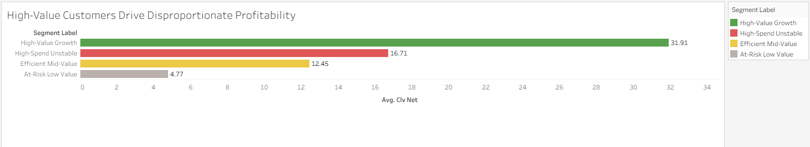
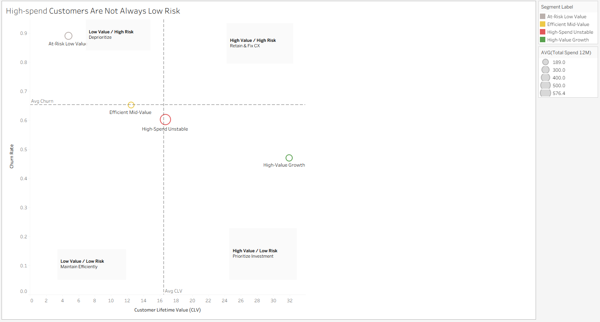
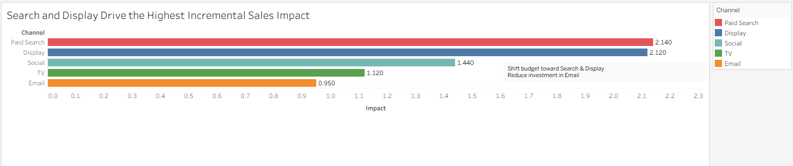
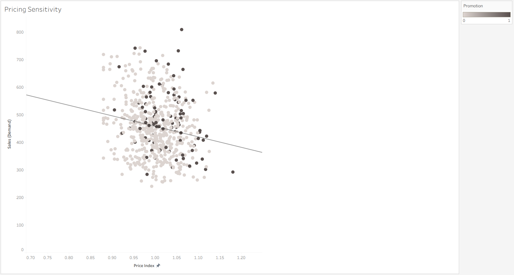
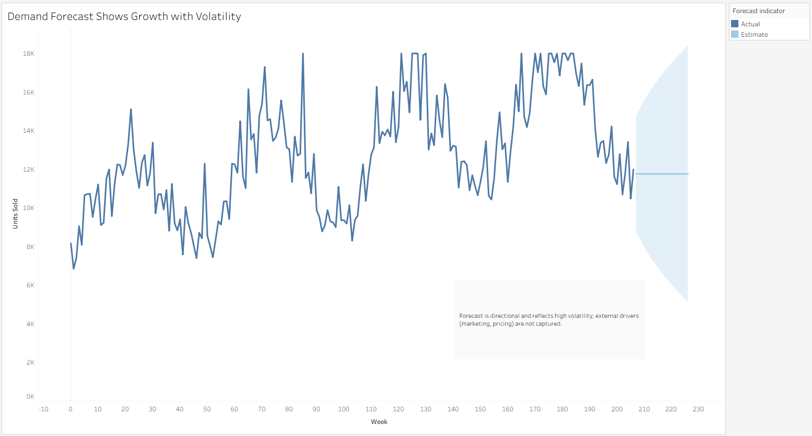

#Omnichannel Product Growth Strategy
###From Customer Insight to Business Decision

##Overview
This project simulates a product analytics engagement for a retail platform (EverSpring Retail+), focused on improving customer retention, marketing efficiency, and long-term profitability.
The analysis integrates segmentation, attribution, churn modeling, pricing strategy, and forecasting to drive data-informed product and growth decisions.
---
##Business Problem
The company faces:
- High churn in key customer segments 
- Inefficient allocation of marketing spend 
- Unclear drivers of customer lifetime value (CLV) 
---
##Analytical Approach
- Customer Segmentation (K-means clustering)
- Attribution Modeling (first-touch, last-touch, multi-touch) 
-	Marketing Mix Modeling (MMM) (regression) 
-	Churn Prediction (logistic regression) 
-	Pricing & Elasticity Modeling 
-	Text Analysis (customer reviews) 
-	Demand Forecasting (ARIMA) 
---
##Key Insights
-	High revenue does not equal high value → some high-spend users churn more 
-	Customer experience—not spending—is the strongest driver of churn 
-	Paid Search captures demand; Display helps create it 
-	Demand is highly price-sensitive → discounting impacts profit 
---
##Outputs
## Customer Segmentation

This segmentation reveals that high-value users are defined more by engagement and satisfaction than by raw spending, highlighting that long-term value is driven by experience and behavioral patterns rather than transaction volume alone.

---

## Churn Drivers

Churn analysis shows that customer experience—particularly satisfaction and support interactions—is the strongest predictor of churn, while spending and transaction frequency have minimal impact, indicating that retention is driven by service quality rather than usage.

---

## Channel Performance

Channel analysis indicates that Paid Search and Display drive the highest incremental impact, with Paid Search capturing high-intent demand and Display supporting demand creation, while Email shows limited effectiveness and lower return on investment.

---

## Pricing & Promotion Impact

Pricing analysis reveals that demand is highly price-sensitive, with near unit elasticity, meaning price changes significantly affect demand while revenue remains relatively stable, emphasizing the need for targeted promotions over broad discounting.

---

## Demand Forecast

Demand forecasting shows an overall upward trend with seasonal fluctuations and uncertainty, suggesting the need for flexible planning, strategic budget allocation, and inventory readiness to capitalize on peak demand periods.
---
##Recommendations
-	Prioritize high-value, low-churn segments 
-	Improve customer experience to reduce churn 
-	Reallocate budget toward high-impact channels 
-	Replace blanket discounts with targeted promotions 
---
##Next Steps (Experimentation)
To validate and extend these findings:
-	A/B test onboarding improvements for high-risk users 
-	Test targeted promotions vs blanket discounts 
-	Experiment with customer support interventions on churn 
---
##Tools Used
-	R (tidyverse, clustering, regression, forecasting) 
-	Tableau (dashboarding) 
-	Excel (data preparation)
---
